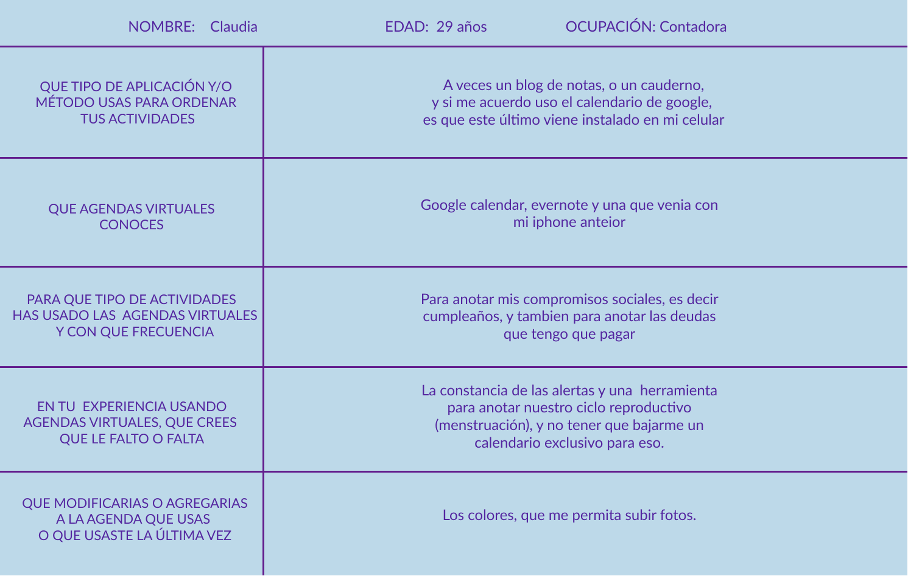
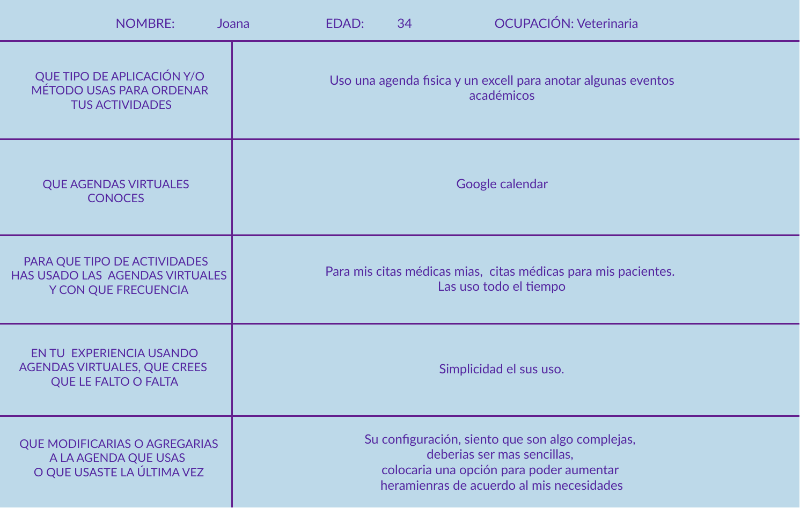
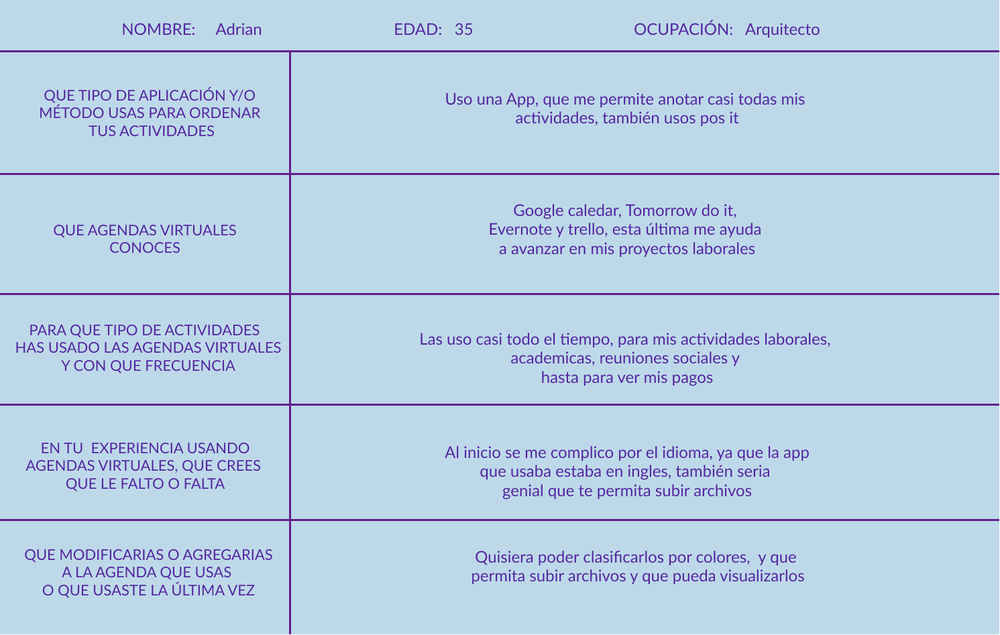
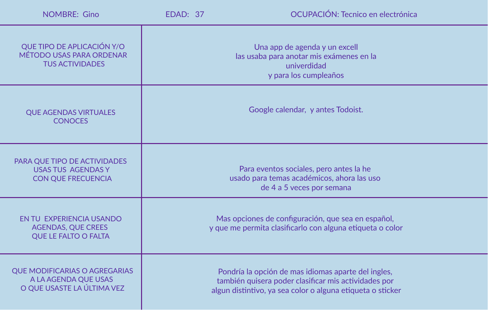
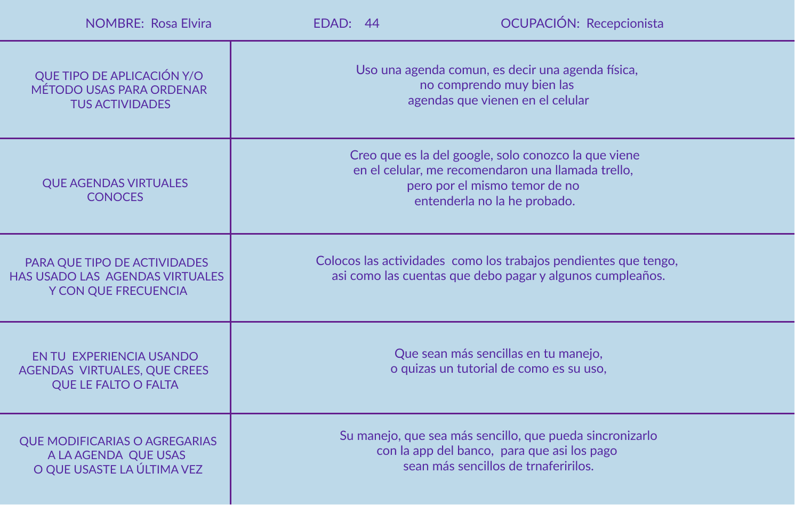
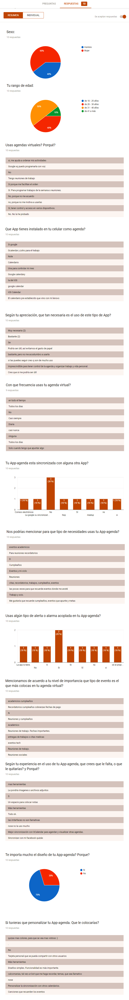
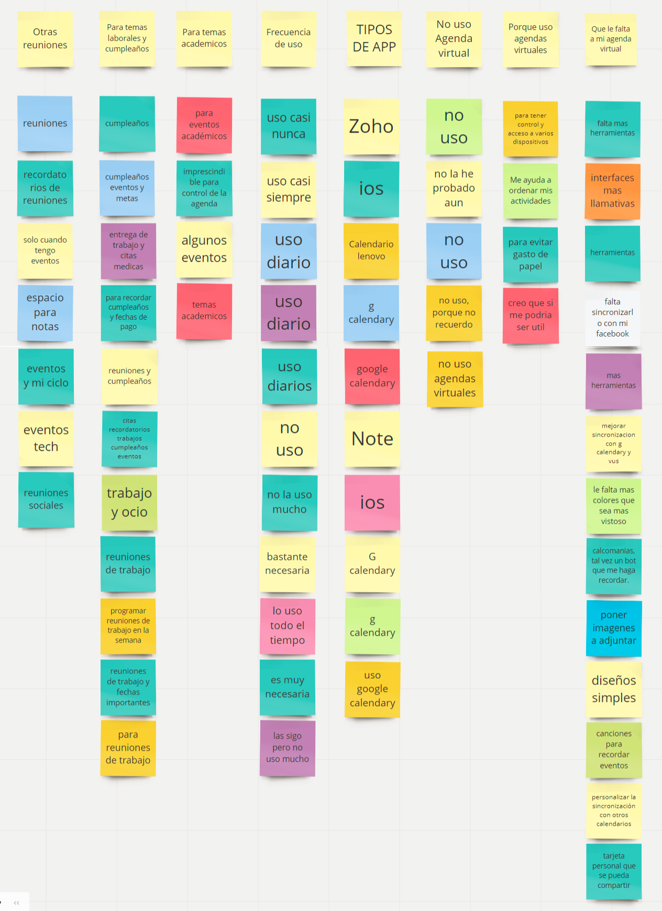

# **MOMO APP**

El proyecto MOM App consiste en el diseño de una aplicación en base a la creación de una agenda virtual, revisando las funciones y herramientas que brina la mayoria de agendas virtuales, para mejorar la experiencia de usuario. A través de un proceso de investigación y conocimiento del usuario, se logro identificar las necesidades que el usuario prioriza de acuerdo a su tipo de uso.

## OBJETIVO

Brindar una aplicación que ordene, guíe, recuerde y acompañe a los usuarios en sus eventos diarios y/o esporádicos, de acuerdo a las actividades que realice en su rutina.

## **DESARROLLO**

## **RESEARCH**

- Para la resolución del reto seguimos las etapas de Diseño Centrado en el Usuario (DCU) y las herramientas de Design Thinking. 

### Etapa Diseño Centrado en el usuario (DCU):

### A. Descubrimiento:

**Actividades**

**I.- Entrevistas personales**

Se realizaron entrevistas a 5 usuarios, en las que se les explicó el proyecto a realizarce, se les realizó unas preguntas, para luego solicitar que nos comenten sus experiencias con las agendas que han usado o conocen. 

Al final de la entrevista, se les pidió a cada usuario ingresar a la agenda que usan en la actualidad, o la App que tienen instalada en su celular, se les pidio realizar la colocación de un evento, y que nos cuenten como fue la experiencia. 

 **1.  Claudia (29 años)**

 **3.  Joana (34 años)**

 **2. Adrian (35 años)**

 
 **5. Gino (37 años)**

 

 **4. Rosa (44 años)**
 
 

 **Conclusiones de las entrevistas**

- 3 de 5 usuarios mostraron confusion al momento de la colocar el evento.
- Los contenidos de las agendas que usan no son de conforme entendimiento.
- 4 de 5 piensan que la información que les muestra su agenda es poco relevante, considerando que en ese lugar podría haber opciones de mayor validdez. 
- 3 de 5 mostraron molestias con la alarma de la agenda, sin poder cambiarla o editarla.
- El total de los usuarios muestra disconformidad en el diseño de la App, considerandolo como poco amigable. 
- El total de las mujeres expresa que quiseras una herramientas espcífica para anotar su ciclo menstrual, y no tener la necesidad de instalar una app exclusiva para es e objetivo.

**II.- Encuesta virtual**

 

 **Conclusiones de la encuesta virtual**

- El 50% de los usuarios que desarrollaron la encuesta se encuentran entre 31 a 40 años de edad. 
- El 40% de los usuarios muestra inconformidad casi total al uso de las agendas virtuales. 
- La mayoria registra actividades relacionadas a temas laborales y eventos sociales, tales como: cumpleaños, reuniones de amigos.
- La mayoria de los usuarios tiene conocimiento de la agenda de google, que en muchas veces viene instala por defecto en el celular, solo una pequeña minoria conoce otras agendas.
- La mayoria de los usuarios muestra disconformidad en la configuracion en las herramientas y configuración de las agendas que usan. 
- Cuando se les pidió que sugirieran herramientas o ediciones en sus app-agendas, ellos consideran importante el uso de etiquetas o de colores distintos de acuerdo al tipo de actividad que realizan. 

**Affinity map**

**Mapa conceptual**